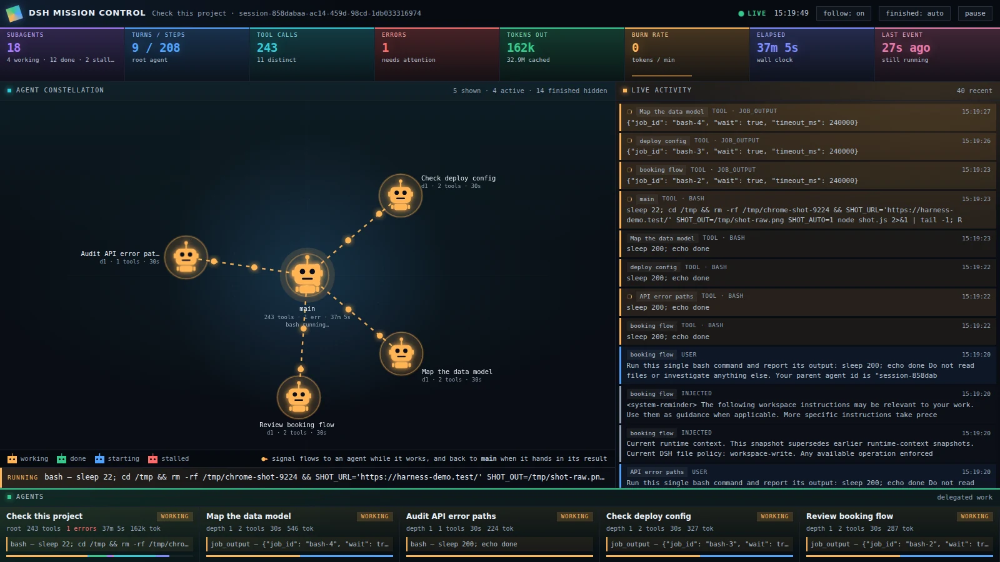

# DSH Mission Control

A read-only live view over the session logs that DeepSeek Harness writes to `~/.dsh`,
answering *what are the agents doing right now?*



The whole app is one page — `index.php` — plus `api.php`. It reads session logs that DSH
has already written, so DSH does not need to be running, and nothing under `~/.dsh` is
ever written or moved.

> **There is no authentication anywhere in this app.** It renders your entire session
> history: every prompt, reply, command, file path and tool result. Keep it on
> `127.0.0.1` or behind an authenticating proxy — see
> [Before you expose it](#before-you-expose-it).

## Requirements

| Piece | Why |
|---|---|
| PHP 8.2+ | the whole app |
| PHP `FFI` extension | drives the system `libzstd` (see [below](#why-there-is-a-decoder-in-here)) |
| `libzstd` ≥ 1.4 | a session log is a series of concatenated zstd frames |
| DSH session logs | `~/.dsh/sessions/` must exist and be readable |

## Install and setup

No build step, no Composer install, no database, no config file. Clone it, check the
requirements, point a web server at the directory.

```bash
git clone https://github.com/<you>/dsh-mission-control.git
cd dsh-mission-control
```

### 1. Check the requirements

```bash
php -v                       # 8.2 or newer
php -m | grep -i '^ffi'      # FFI must be listed
ldconfig -p | grep libzstd   # libzstd.so.1 must be found
ls ~/.dsh/sessions           # DSH must have written at least one session
```

If something is missing:

| Distro | Install |
|---|---|
| Debian / Ubuntu | `sudo apt install php8.2-cli php8.2-fpm php8.2-ffi libzstd1` |
| Fedora / RHEL | `sudo dnf install php-cli php-fpm php-ffi libzstd` |
| macOS (Homebrew) | `brew install php zstd` |

On Debian and Ubuntu, `FFI` normally ships inside `php8.x-common`; if `php -m` does not
list it, install `php8.2-ffi` and restart PHP.

### 2. Run it

**Quickest — PHP's own server, for looking at it on your own machine:**

```bash
php -S 127.0.0.1:8080
# open http://127.0.0.1:8080/
```

That binds to localhost only and is not something to expose. It works under any SAPI: if
`FFI::cdef()` is unavailable in-process, the decoder automatically shells out to
`bin/zstddump.php`, which is why the same code runs unchanged under FPM.

**Or behind nginx + PHP-FPM** — any ordinary PHP vhost will do:

```nginx
server {
    listen 80;
    server_name dsh.test;
    root /path/to/dsh-mission-control;
    index index.php;

    location / { try_files $uri $uri/ /index.php?$query_string; }

    location ~ \.php$ {
        include fastcgi_params;
        fastcgi_pass unix:/run/php/php8.2-fpm.sock;
        fastcgi_param SCRIPT_FILENAME $realpath_root$fastcgi_script_name;
    }

    # keeps .git and the var/ cache out of reach
    location ~ /\.(?!well-known) { deny all; }
}
```

### 3. The one gotcha: which user PHP runs as

The app locates DSH by reading `$HOME`, and falls back to the home directory of the user
the PHP process is running as. So **the PHP user must be the one that owns `~/.dsh`** —
normally you.

If PHP-FPM runs as `www-data` while your logs are in `/home/you/.dsh`, the dashboard will
come up empty. Run the pool as yourself instead:

```ini
; /etc/php/8.2/fpm/pool.d/dsh.conf
[dsh]
user = yourname
group = yourname
listen = /run/php/php8.2-fpm-dsh.sock
```

…then point `fastcgi_pass` at that socket.

The same user also needs to write `var/cache/` inside the project (that is the decoded-log
cache, and the only thing this app ever writes), so make sure the project directory is
writable by it — or pre-create `var/cache` owned by that user.

### 4. Open it

Open the site root. With no `?id=` it **follows whichever session is newest**, so just
start a DSH session and delegate to a sub-agent — the robots appear within a second or
two. Append `?id=<session-id>` to pin one session instead.

## The monitor (live)

Polls `api.php?action=live` every 1.5 s and redraws. It is built around the fact that
DSH stores each sub-agent as **its own session log** linked by `parentSession`, and
announces it in the parent with a `subagent/catalog` event carrying a human label.

| Area | Shows |
|---|---|
| Metric tiles | sub-agents working/done/stalled, turns, steps, tool calls, errors, tokens, **burn rate** (smoothed, with sparkline), elapsed, time since last event |
| Agent constellation | robots: `main` at the centre, each sub-agent orbiting by delegation depth, coloured by status |
| Edges | **glowing signal dots flow outward while an agent works**; when it finishes, they flow back to `main` for a few seconds (the hand-off) |
| NOW bar | the tool the root agent is executing this second, or "thinking" while it waits on the model |
| Live activity | merged feed from every agent, newest first, short names, spinner on in-flight tools |
| Agent cards | per agent: status, depth, tool count, errors, duration, tokens, current activity, tool-mix bar |

Controls in the header:

| Button | Effect |
|---|---|
| `follow: on/off` | **on** (the default when opened without `?id`) tracks whichever session is newest, so a session started later is picked up automatically. **off** pins the page to the session you are watching. |
| `finished: auto/shown/hidden` | Cycles three modes. **auto** (default) drops a finished agent 6s after its last event; **shown** keeps every agent; **hidden** never draws a finished one. Applies to both the constellation and the roster. |
| `pause` | Stops polling without losing the current view. |

#### Agents never disappear on their own

An agent on this screen is a **file on disk**, not a running process: the monitor
re-globs `~/.dsh/sessions` every poll and draws one robot per log it finds. DSH has no
deletion or retention API, so a finished agent's log stays forever and the agent would
stay on screen forever — hence auto-hide, which is a *view* filter, not deletion.

Sub-agents spawn as `mode: "continuable"`: the harness keeps a durable session and will
start a fresh turn if the agent is sent another message. That writes a new `turn/start`,
the status flips back to `working`, and **the agent reappears by itself** — so hiding is
safe. They do not wake on their own; only an explicit message revives one.

Auto-hide keys off **finished**, not raw quiet time, on purpose: an agent waiting on the
model writes no log events for 20–60 s while it is genuinely working, so hiding on
quiet-time alone would make robots blink out mid-thought and reappear.

#### Stalled agents

Status comes from the log: a turn is open while `turn/start` outnumbers `turn/end`. An
interrupted continuable sub-agent can leave a turn open with nothing behind it — the
harness starts a fresh turn to deliver the "stopped" notice, that turn is abandoned, and
no later event will ever balance the count. Such an agent would read as `working`
permanently, which is how a live demo ended up with phantom robots that nothing could
clear.

So an open turn that has **both** been silent for over 5 minutes **and** has no tool in
flight is reported as **`stalled`** (red), and auto-hide drops it like a finished agent.
Requiring both is what makes it safe: a slow command holds a pending tool call for its
whole run, so a genuinely long tool call is never mislabelled, and an agent that is merely
thinking is nowhere near 5 minutes.

A busy ring grows its radius with the agent count and labels radiate outward from each
node, so ten concurrent delegations stay readable rather than overlapping.

### Orbits and collision avoidance

Each sub-agent drifts along its depth's ring at its **own random speed and direction**
(0.075–0.24 rad/s, so a lap takes roughly 26–84 s). The constellation is therefore a
living thing rather than a snapshot that jumps every 1.5 s poll. Two rules keep the
robots apart:

| Rule | Effect |
|---|---|
| **Predictive bounce** | an agent *closing* on a neighbour within 88 px reverses both agents' directions, so it turns away before contact |
| **Hard separation** | anything still inside 52 px — robots are ~49 px wide — is pushed apart along each agent's ring tangent, capped at 0.14 rad/frame |

The reversal cooldown is **per pair**, not per agent: one bounce must not leave an agent
blind to the next neighbour it is about to meet. Verified in headless Chrome against a
41-agent replay — minimum pair distance 48–51 px, i.e. no robots touching.

Angles and velocities live in JS state, never on the DOM: `renderGraph()` rebuilds the
SVG from a string on every poll, so anything hung off an element would die 1.5 s later.
Motion is skipped entirely under `prefers-reduced-motion: reduce`.

The signal dots are the one thing that had to change shape. They used to be SMIL
`animateMotion` riding a static path, which would have left them sailing down a line the
robot had already left. They are now plain circles lerped along the parent→child segment
by the same animation loop, so they stay glued to both moving endpoints.

### Layout

One screen, no page scroll: `bar / metric tiles / stage / agent roster`, built as a
**gapless mosaic**. Panels are separated by 1px rules rather than gaps, carry no rounded
corners, and are tinted by hue — cyan for the constellation, amber for activity, green for
the roster — while each metric tile has its own accent colour. Only the feed scrolls
vertically and the roster scrolls sideways. Below 1000px wide the stage stacks and the
page is allowed to scroll again.

```bash
curl 'http://127.0.0.1:8080/api.php?action=live'          # newest root session
curl 'http://127.0.0.1:8080/api.php?action=live&id=<id>'  # a specific root
```

## Why there is a decoder in here

DSH stores a session as `session.vN.jsonl.zstd` — and it is **not** one zstd stream.
It is a *series of concatenated zstd frames*, one per append:

```
[frame: session header][frame: event][frame: event][frame: …]   ← one frame per append
```

That breaks the obvious tools:

| Approach | Result |
|---|---|
| `unzstd` / `zstd` CLI | not installed |
| PHP `zstd` extension | does not exist |
| `zlib.zstdDecompressSync` (node 24) | decodes the **first frame only** (215 bytes, 1 event) |
| `zlib.createZstdDecompress()` | also stops at frame 1 unless you reset the stream between frames |

Node's decoder is the seductive near-miss: it looks like it works, and quietly returns
1 event out of ~1,900.

The machine does have `libzstd1` (1.5.5), so `lib/Zstd.php` walks the frames with
`ZSTD_findFrameCompressedSize()` / `ZSTD_decompress()` and joins them. Measured frame
sizes: 86–34,538 B compressed, 79–150,463 B decompressed, and **every frame reports an
unknown content size** — so the destination buffer cannot be pre-sized from the header
and must be grown on `ZSTD_error_dstSize_tooSmall` (code 70), which is deliberately
*not* treated as end-of-input.

One wrinkle: PHP-FPM ships `ffi.enable=preload`, which forbids `FFI::cdef()` inside a
web request. Rather than weaken the shared PHP config (and risk the 50 other sites on
the same 8.2 pool), the decoder detects that and falls back to `bin/zstddump.php`,
which runs under the CLI SAPI where FFI is allowed. Same class, same library, bytes
piped over stdin.

```
browser ──► index.php / api.php ──► LiveMonitor ──► Zstd::decompressedCached()
                                          │                  │
                                          │      FFI allowed? ├─ yes ─► libzstd in-process (CLI)
                                          │                  └─ no  ─► bin/zstddump.php ─► libzstd
                                          │                  │
                                          │                  └─► var/cache/<sha1>.jsonl + .offset
                                          └─► per-agent counters, tree, feed ─► JSON ─► SVG/DOM
```

Decoding is **incremental**: the cache stores how many compressed bytes have already
been consumed, so a poll only decodes the new tail — a full decode of the largest log
(~2 MB compressed) is ~33 ms in-process, and a caught-up poll does no decoding at all.
The offset always lands on a frame boundary, so a log that is still being written simply
retries its incomplete last frame next time.

## Files

```
README.md           this file — install, setup and design notes
LICENSE             MIT
docs/screenshot.*   the image above
index.php           live monitor shell (embeds the first snapshot) — the site root
api.php             JSON: live only
lib/Zstd.php        concatenated-frame zstd reader, incremental cache, CLI fallback
lib/LiveMonitor.php live snapshot: agent tree, counters, status, recent feed
bin/zstddump.php    CLI decoder used by the FPM fallback (reads stdin only)
assets/monitor.*    live monitor styling + rendering
var/cache/          decoded logs — three files per session (.jsonl, .offset, .lock)
```

## Safety

- **Read-only** against `~/.dsh`. Nothing under it is written or moved.
- `bin/zstddump.php` reads only stdin, so it has no filesystem surface of its own.
- `?id=` is only ever used as a key into the session-header map, never as a path, so it
  offers no traversal surface; an unknown id is a 404.
- Tolerant decoding: a session still being appended to may end in a partial frame, so a
  trailing decode failure returns the events decoded so far instead of erroring.
- Token totals come from the harness's projection cache; per-message usage comes from
  `assistant/message` events.

## Before you expose it

This is a local developer tool: **no authentication, no sessions, no rate limiting, no
read-only viewer mode.** Anyone who can reach the URL can read every session you have ever
run — prompts, replies, commands, file paths and tool output.

- Bind it to `127.0.0.1` (as the `php -S` example does) or to a private interface only.
- To reach it from elsewhere, put it behind a reverse proxy that authenticates, and keep
  the DSH host itself off the public internet.
- Do not drop the `location ~ /\.` rule from the nginx snippet — that is what keeps
  `.git/` (and so your full repository history) from being served.

## License

[MIT](LICENSE) — use it, fork it, modify it, ship it, sell it. No warranty.
